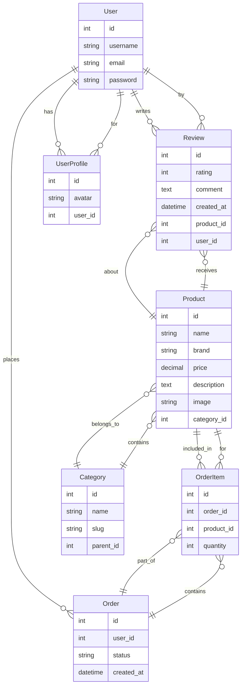

# Entity-Relationship Diagram (ERD)

This diagram shows the main entities and relationships in the SDR World Django project.

```mermaid
erDiagram
    User ||--o{ Review : writes
    User ||--o{ Order : places
    User ||--o{ UserProfile : has
    Product ||--o{ Review : receives
    Product ||--o{ OrderItem : included_in
    Product }o--|| Category : belongs_to
    Category ||--o{ Product : contains
    Order ||--o{ OrderItem : contains
    Review }o--|| Product : about
    Review }o--|| User : by
    OrderItem }o--|| Product : for
    OrderItem }o--|| Order : part_of
    UserProfile }o--|| User : for

    User {
        int id
        string username
        string email
        string password
    }
    UserProfile {
        int id
        string avatar
        int user_id
    }
    Product {
        int id
        string name
        string brand
        decimal price
        text description
        string image
        int category_id
    }
    Category {
        int id
        string name
        string slug
        int parent_id
    }
    Review {
        int id
        int rating
        text comment
        datetime created_at
        int product_id
        int user_id
    }
    Order {
        int id
        int user_id
        string status
        datetime created_at
    }
    OrderItem {
        int id
        int order_id
        int product_id
        int quantity
    }
``` 